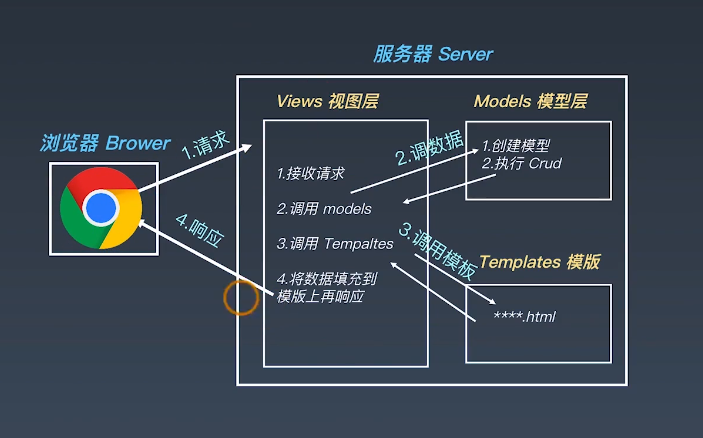
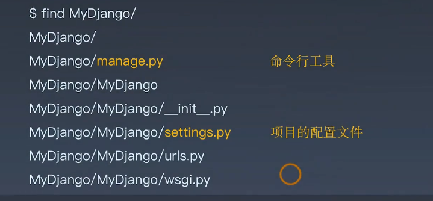
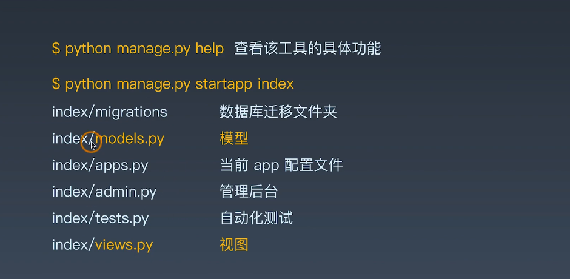

# WEEK4 DJANGO Web开发


## 开发环境配置


### Django框架简介

+   Django是一个开放源代码的web应用框架
+   最初用于管理劳伦斯出版集团旗下的一些以新闻内容为主的网站
+   2005年7月再BSD许可证下发布


### MTV框架模式

+   模型（Model）
+   模板（Template）
+   视图（Views）




### Django的特点

+   采用MTV的框架

+   强调快速开发和代码服用DRY（Do Not Repeat Yourself）

+   组件丰富：

    +   ORM（对象关系映射）映射类来构建数据模型
    +   URL支持正则表达式
    +   模板可以继承
    +   内置用户认证，提供用户认证和权限功能
    +   admin管理系统
    +   内置表单模型、Cache缓存系统、国际化系统等

    

## Django的版本

Django最新3.0版本，目前比较多的是2.2.13（LTS）

```cmd
>pip install --upgrade django==2.2.13
```


## 创建项目和目录结构

创建Django项目

`diango-admin startproject MyDjango`

目录结构如下：




查看改工具的具体功能

`python manage.py help`

启动app

`python manage.py startapp index`




运行 web服务端

```powershell
// 默认时127.0.0.1：8000
python manage.py runserver
// 修改端口
python manage.py runserver 0.0.0.0:80
```


## 解析settings.py主要配置文件

项目文件包括：

+   项目路径
+   密钥
+   域名访问权限
+   App列表
+   静态资源，包括CSS、JavaScript图片等
+   模板文件
+   数据库配置
+   缓存
+   中间件

DEBUG = True 用于打开调试日志


以下是settings.py

一般需要修改的是数据库的类型

启动的APP

```python
"""
Django settings for MyDjango project.

Generated by 'django-admin startproject' using Django 2.2.13.

For more information on this file, see
https://docs.djangoproject.com/en/2.2/topics/settings/

For the full list of settings and their values, see
https://docs.djangoproject.com/en/2.2/ref/settings/
"""

import os

# Build paths inside the project like this: os.path.join(BASE_DIR, ...)
BASE_DIR = os.path.dirname(os.path.dirname(os.path.abspath(__file__)))


# Quick-start development settings - unsuitable for production
# See https://docs.djangoproject.com/en/2.2/howto/deployment/checklist/

# SECURITY WARNING: keep the secret key used in production secret!
# 密钥
SECRET_KEY = '1s1-q@t(aqr*br9usdif8)(gcg=8tk6$bry-8x54s@+szc4e_m'

# SECURITY WARNING: don't run with debug turned on in production!
DEBUG = True

# 域名访问权限
ALLOWED_HOSTS = []


# Application definition
# App列表 注意不要调整上下顺序
INSTALLED_APPS = [
    # 内置的后台管理系统
    'django.contrib.admin',
    # 内置的用户认证系统
    'django.contrib.auth',
    # model元数据
    'django.contrib.contenttypes',
    # 会话 表示当前访问网站的用户身份
    'django.contrib.sessions',
    # 消息提示
    'django.contrib.messages',
    # 静态资源路径
    'django.contrib.staticfiles',
    ##### 注册自己的APP
    'index',
]
#### 中间件是request和response对象之间的钩子 注意不熟悉不要调整上下顺序
MIDDLEWARE = [
    'django.middleware.security.SecurityMiddleware',
    'django.contrib.sessions.middleware.SessionMiddleware',
    'django.middleware.common.CommonMiddleware',
    'django.middleware.csrf.CsrfViewMiddleware',
    'django.contrib.auth.middleware.AuthenticationMiddleware',
    'django.contrib.messages.middleware.MessageMiddleware',
    'django.middleware.clickjacking.XFrameOptionsMiddleware',
]
# 通过这个文件 对你的URL请求和资源文件对应一个匹配
# 同一资源定位符的配置 --- urls.py
ROOT_URLCONF = 'MyDjango.urls'

# 模板设置
TEMPLATES = [
    {
        # 定义模板的引擎
        'BACKEND': 'django.template.backends.django.DjangoTemplates',
        # 设置模板路径
        'DIRS': [],
        # 是否再APP里面查找模板文件
        'APP_DIRS': True,
        # 用于RequesetContext上下文的调用函数
        'OPTIONS': {
            'context_processors': [
                'django.template.context_processors.debug',
                'django.template.context_processors.request',
                'django.contrib.auth.context_processors.auth',
                'django.contrib.messages.context_processors.messages',
            ],
        },
    },
]
# wsgi
WSGI_APPLICATION = 'MyDjango.wsgi.application'

# 指定数据库 默认是sqlite 可以换成自己的MySQL
# Database
# https://docs.djangoproject.com/en/2.2/ref/settings/#databases

# DATABASES = {
#     'default': {
#         'ENGINE': 'django.db.backends.sqlite3',
#         'NAME': os.path.join(BASE_DIR, 'db.sqlite3'),
#     }
# }

# export PATH=$PATH:/usr/local/mysql/bin
# OSError : mysql_config not found 
# pip install mysqlclient
# pip install pymysql
DATABASES = {
    'default': {
        # 引擎
        'ENGINE': 'django.db.backends.mysql',
        'NAME': 'testdb',
        'USER': 'testuser',
        'PASSWORD': 'testpass',
        'HOST': '192.168.0.106',
        'PORT': '3306',
    }

    # 生产环境可能连接第二个数据库
    # 'db2': {
    #     # 引擎
    #     'ENGINE': 'django.db.backends.mysql',
    #     'NAME': 'mydatabase',
    #     'USER': 'mydatabaseuser',
    #     'PASSWORD': 'mypasswork',
    #     'HOST': '192.168.0.106',
    #     'PORT': '3306',
    # }
}

# Password validation
# https://docs.djangoproject.com/en/2.2/ref/settings/#auth-password-validators

AUTH_PASSWORD_VALIDATORS = [
    {
        'NAME': 'django.contrib.auth.password_validation.UserAttributeSimilarityValidator',
    },
    {
        'NAME': 'django.contrib.auth.password_validation.MinimumLengthValidator',
    },
    {
        'NAME': 'django.contrib.auth.password_validation.CommonPasswordValidator',
    },
    {
        'NAME': 'django.contrib.auth.password_validation.NumericPasswordValidator',
    },
]


# Internationalization
# https://docs.djangoproject.com/en/2.2/topics/i18n/

LANGUAGE_CODE = 'en-us'

TIME_ZONE = 'UTC'

USE_I18N = True

USE_L10N = True

USE_TZ = True


# Static files (CSS, JavaScript, Images)
# https://docs.djangoproject.com/en/2.2/howto/static-files/

STATIC_URL = '/static/'

```


## urls调度器

在Django中一般称作 URLconf


### Django如何处理一个请求

当一个用户请求Django站点的一个页面：

1.  如果传入HttpRequest对象拥有urlconf属性（通过中间件设置），它的值将被用来代替 `ROOT_URLCONF`设置
2.  Django加载URLconf模板并寻找可用的urlpatterns，Django一次匹配每个URL模式，再与请求的URL匹配的第一个模式停下来
3.  一旦有URL匹配成功，Djagno导入并调用相关的试图，视图会获得如下参数：
    +   一个HttpReques实例
    +   一个或多个位置参数提供
4.  如果没有URL被匹配，或者匹配过程中出现了异常，Django会调用一个适当的错误处理视图


### 增加项目urls

可以看到urls.py文件中

```python
from django.contrib import admin
from django.urls import path,include

urlpatterns = [
    # 默认
    path('admin/', admin.site.urls),
    # 自己添加
    path('', include('index.urls')),
]

```

增加index的urls

```python
# index/urls.py
from django.urls import path
form . import views

urlpatterns=[
    path('', views.index)
]
```

```python
# index/views.py
from django.shortcuts import render
from django.http import HttpResponse

def index(request):
    return HttpResponse("Hello Django!")
```


==整个流程：==

1.  通过命令行 `python manage.py runserver`  运行manage.py
2.  manage会找settings.py这个文件，在63行， 有个`ROOT_URLCONF = 'MyDjango.urls'`  从而会找到urls.py这个文件
3.  urls.py中 有一段 path中通过include添加自己的视图文件
4.  会找到./index/urls.py文件  里面 `path('', views.index)`  
5.  会从当前目录的views.py中找到index这个函数


## 模块和包

模块：.py结尾的Python程序

包: 存放多个模块的目录

__ init__.py  包运行的初始文件，可以是空文件


常见的以下几种方式导入:

+   import
+   from ... import ...
+   from .. import ... as...


从同一级目录引用模块

```python
from . import Module1   
```

从同一级目录引用包PKG2里面的模块M2

```python
from .PKG2 import M2
```

__ init__.py在你引用这个包的时候会首先调用一次


## 让URL支持变量


Django支持对URL设置变量，URL变量类型包括:

+   str
+   int
+   slug
+   uuid
+   path

```python
path('<int:year>', views.myyear),
```


urls.py

```python
# index/urls.py
from django.urls import path
from . import views

urlpatterns=[
    path('', views.index),

    ### 带变量的URL
    path('<int:year>', views.year), # 值接受整数，其他类型返回404
    path('<int:year>/<str:name>', views.name),

]

```


views.py

```python
from django.shortcuts import render

# Create your views here.
from django.http import HttpResponse

def index(request):
    return HttpResponse("Hello Django Timo!")

def year(request, year):
    return HttpResponse(year)

#                   获取不定长关键字参数
def name(request, **kwargs):
    return HttpResponse(str(kwargs['year'])+kwargs['name'])
```

==通过**可以获取不定长参数==


## URL正则和自定义过滤器

urls.py

```python
# ?P表示后面是一个变量和他们能够匹配的正则表达式 .html表示匹配网页
# 0-9表示数字范围  4表示要四位数字
re_path('(?P<year>[0-9{4}]).html', views.myyear, name='urlyear'),

```


view.py

```python
def myyear(request, year):
    return render(request, 'yearview.html')    
```


Templates文件夹增加yearview.html


自定义过滤器

```python
from . import views, converters

register_converter(converters.IntConverter, 'myint')
register_converter(converters.FourDigitYearConverter, 'yyyy')

### 自定义过滤器
# path('<myint:year>', views.myyear),
path('<yyyy:year>', views.myyear),
```


converters.py

```python
class IntConverter:
    regex = '[0-9]+'

    def to_python(self, value):
        return int(value)

    def to_url(self, value):
        return str(value)

class FourDigitYearConverter:
    regex = '[0-9]{4}'

    def to_python(self, value):
        return int(value)

    def to_url(self, value):
        return '%04d' % value

```


## view视图快捷方式


response是正常的返回

render是对response的封装


### Django快捷函数

+   **render()**

    将给定的模块与给定的上下文字典组合在一起，并以渲染的文本返回一个HttpResponse对象

+   **redirect()**

    将一个HttpResonseRedirect返回到传递的参数的适当URL

+   **get_object_or_404()**

    在给定的模型管理器(model manager)上调用get().但它会引发Http404而不是模型的DoesNotExist异常


## 使用ORM创建数据表

### 模型与数据库

+   每个模型哦都是一个python的类，这些类继承了django.db.models.Model
+   模型类的每个属性都相当于一个数据库的字段
+   利用这些，Django提供了一个自动生成访问数据库的API

```python
from django.db import models
class Person(models.Model):
    
    id = models.integerField(primary_key=True)
    first_name = models.CharField(max_length=30)
    last_name=models.CharField(max_length=30)
```

上面对应下面的SQL

```sql
CREATE TABLE myapp_person(
	"id"serial NOT NULL PRIMARY KEY,
    "first_name" varchar(30) NOT NULL,
    "last_name" varchar(30) NOT NULL
);
```

```powershell
// 根据models.py会自动生成中间的py文件
$python manage.py makemigrations
// 应用对应的中间py文件到数据库中
$python manage.py migrate
```


修改/MyDjango/__ init__.py文件

django使用的是mysqldb

==我的windows貌似不用改也能用==

```python
import pymysql 
pymysql.install_as_MySQLdb()

# pip install pymysql
```

添加mysql客户端路径

export PATH=$PATH:/usr/local/mysql/bin

如果报版本错误，则需要把版本判断的代码屏蔽掉

如果报decode错误则屏蔽掉

```python
query = getattr(cursor, '_executed', None)
# if query is not None:
#     query = query.decode(errors='replace')
return query
```


### ORM API

数据表的读写

python manage.py shell

```shell
from index-models import *
n = Name()
n.name = '红楼梦'
n.author='曹雪芹'
n.stars=9.6
n.save()

# 使用ORM框架api实现
# 增
from index.models import *
Name.objects.create(name='红楼梦', author='曹雪芹', stars='9.6')
Name.objects.create(name='活着', author='余华', stars='9.4')

# 查
Name.objects.get(id=2).name

# 改
Name.objects.filter(name='红楼梦').update(name='石头记')

# 删
# 单条数据  filter相当于mysql中的WHERE
Name.objects.filter(name='红楼梦').delete()
# 全部数据
Name.objects.all().delete

# 其他常用查询
Name.objects.create(name='红楼梦', author='曹雪芹', stars='9.6')
Name.objects.create(name='活着', author='余华', stars='9.4')
Name.objects.all()[0].name
n = Name.objects.all()
n[0].name
n[1].name

Name.objects.values_list('name')
Name.objects.values_list('name')[0]
# filter支持更多查询条件
filter(name=xxx, id=yyy)

# 可以引用python的函数 比如count就是python的方法
Name.objects.values_list('name').count()
```


## 模板

+   模板变量{{variables}}
+   从URL获取模板变量    在django中相当于从html返回到urls.py查找urlyear,再从views.py中找到对应的函数,在html中写灵活的链接时用到
+   读取静态资源内容 
+   for遍历标签
+   if判断标签


## 展示数据库中的内容

==locals方法可以一次性把所有参数传递过去==


## 豆瓣页面展示功能的需求分析

URLConf对网址做处理


## urlconf与models配置


URLconf的处理

http://ip/xxx

http://ip/yyy

http://ip/douban/xxx

http://ip/douban/yyy

将URL中的douban/注册成一个独立的APP


==1.创建一个新的APP==

```powershell
python manage.py startapp Douban
```

2.  在setting.py中添加自己的APP

    `'Douban',`

3.  在urls.py中配置APP的路径 ==注意路径后面一定要加/==

    `path('douban/', include('Douban.urls'))`

4.  在Douban目录里面编写一个urls.py文件

5.  在views.py写好对应的函数接口

6.  使用命令 `python manage.py inspectdb > models.py` 可以反向创建数据表 

    反向生成的数据带着元数据 **managed = False** ，表示会以数据库的数据结构为准，防止误操作修改数据结构导致和数据库数据不符


## views视图的编写

views.py

```python
from django.shortcuts import render

# Create your views here.
from .models import T1
from django.db.models import Avg
from django.http import HttpResponse


def books_short(request):
    # 从models取数据传给template
    shorts = T1.objects.all()
    # 评论数量
    counter = T1.objects.all().count()

    # 平均星级
    star_avg=f"{T1.objects.aggregate(Avg('n_star'))['n_star__avg']:0.1f}"

    # 情感倾向
    sent_avt=f"{T1.objects.aggregate(Avg('sentiment'))['sentiment__avg']:0.2f}"

    # 正向数量
    queryset = T1.objects.values('sentiment')
    condtions = {'sentiment__gte':0.5}  # 大于
    plus = queryset.filter(**condtions).count() # 字典的形式

    # 负向数量
    queryset = T1.objects.values('sentiment')
    condtions = {'sentiment__lt':0.5}   # 小于
    minus = queryset.filter(**condtions).count()

    return render(request, 'result.html', locals())
    # return HttpResponse(f'平均星际：{star_avg},\
    #                     情感倾向:{sent_avt},\
    #                     正向数量:{plus},\
    #                     负向数量:{minus}')
```

聚合功能： https://docs.djangoproject.com/zh-hans/2.2/topics/db/aggregation/

`star_avg=f"{T1.objects.aggregate(Avg('n_star'))['n_star__avg']:0.1f}"`


## 结合bootstrap模块进行开发

继承其他html

指定css的路径

```html
<!-- 继承其他html -->
 Welcome 


    <!-- 原有内容进行保留 -->
    {{ block.super }}
    <!-- 指定css路径 -->
    <link rel="stylesheet" href="">
    <link rel="stylesheet" href="">
 

```

{}引用python中的变量，如下

```html
<div class="huge">{{ counter }}</div>
<div class="huge">{{ star_avg }}</div>
```

for in 循环展示

```html

<tr>
    <td>{{short.id}}</td>
    <td>{{short.n_star}}</td>
    <td>{{short.short}}</td>
    <td>{{short.sentiment}}</td>
</tr>
```


## 如何阅读Django的源代码

入口 manage.py


#runserver 其实是一个文件

`python manage.py runserver 8080`

执行这个命令，django会执行五件事情:

+   1.  解析runserver 和 8080 等参数
+   2.  加载runserver文件
+   3.  检查INSTALLED_APPS 、IP端口号、ORM对象
+   4.  实例化WSGIserver
+   5.  动态创建一些类，去接受请求


### manage.py 源码分析

当执行 python manage.py runserver 8080

1.  设置环境变量:

`os.environ.setdefault('DJANGO_SETTINGS_MODULE', 'MyDjango.settings')`


2.  try except的方式导入模块

```python
try:
    from django.core.management import execute_from_command_line
except ImportError as exc:
    raise ImportError(
        "Couldn't import Django. Are you sure it's installed and "
        "available on your PYTHONPATH environment variable? Did you "
        "forget to activate a virtual environment?"
    ) from exc
```


3.  使用模块并传参
    ` execute_from_command_line(sys.argv)`


4.  会调用 `C:\Users\73885\AppData\Roaming\Python\Python37\site-packages\django\core\management\__init__.py`

 init文件的**开头导入了很多的模块**，并调用了一个类进行实例化

```python
import functools
import os
import pkgutil
import sys
from collections import OrderedDict, defaultdict
from difflib import get_close_matches
from importlib import import_module

import django
from django.apps import apps
from django.conf import settings
from django.core.exceptions import ImproperlyConfigured
from django.core.management.base import (
    BaseCommand, CommandError, CommandParser, handle_default_options,
)
from django.core.management.color import color_style
from django.utils import autoreload

```

```python
def execute_from_command_line(argv=None):
    """Run a ManagementUtility."""
    utility = ManagementUtility(argv)
    utility.execute()

```


5.  ManagementUtility 中 先对参数的判断，后面有execute函数
6.  settings.INSTALLED_APPS 加载我们的app文件

7.  判断runserver命令，并做一些检查
8.  判断是否help或者其他命令
9.   如果是runserver 执行`self.fetch_command(runserver).run_from_argv(8080)`

10.  get_commands获取命令的字典给commands变量
11.  app_name = commands[subcommand]  其中subcommand为runserver，获取app名字

12.  *if* isinstance(app_name, BaseCommand): 判断现有的runserver是否已经被加载

13.  执行`klass = load_command_class(app_name, subcommand)`
14.   导入模块

```python
def load_command_class(app_name, name):
    """
    Given a command name and an application name, return the Command
    class instance. Allow all errors raised by the import process
    (ImportError, AttributeError) to propagate.
    """
    module = import_module('%s.management.commands.%s' % (app_name, name))
    return module.Command()
```


15.  通过 `module = import_module('%s.management.commands.%s' % (app_name, name))`判断我们输入的命令加载runserver文件

C:\Users\73885\AppData\Roaming\Python\Python37\site-packages\django\contrib\staticfiles\management\commands\runserver.py


16.  在runserver.py中有一个类 `class Command(RunserverCommand):`， 它的父类 `RunserverCommand`，通过父类执行 ==run_from_argv(8080)==
17.   父类的文件路径为 C:\Users\73885\AppData\Roaming\Python\Python37\site-packages\django\core\management\commands\runserver.py
18.  它的父类 BaseCommand， 路径 C:\Users\73885\AppData\Roaming\Python\Python37\site-packages\django\core\management\base.py
19.  base.py中找到 run_from_argv， 其中 323 `self.execute(*args, **cmd_options)`, 通过这个execute去执行
20.  另外最开始的runserver文件中有个重要的 函数 `def get_handler(*self*, **args*, ***options*):`

21.  会调用父类的get_handler，里面执行了 `get_internal_wsgi_application`, 里面做了WSGI的初始化


