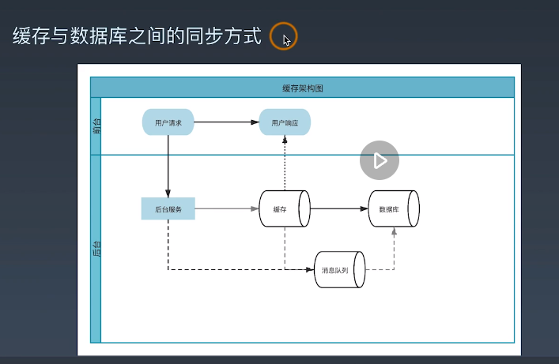
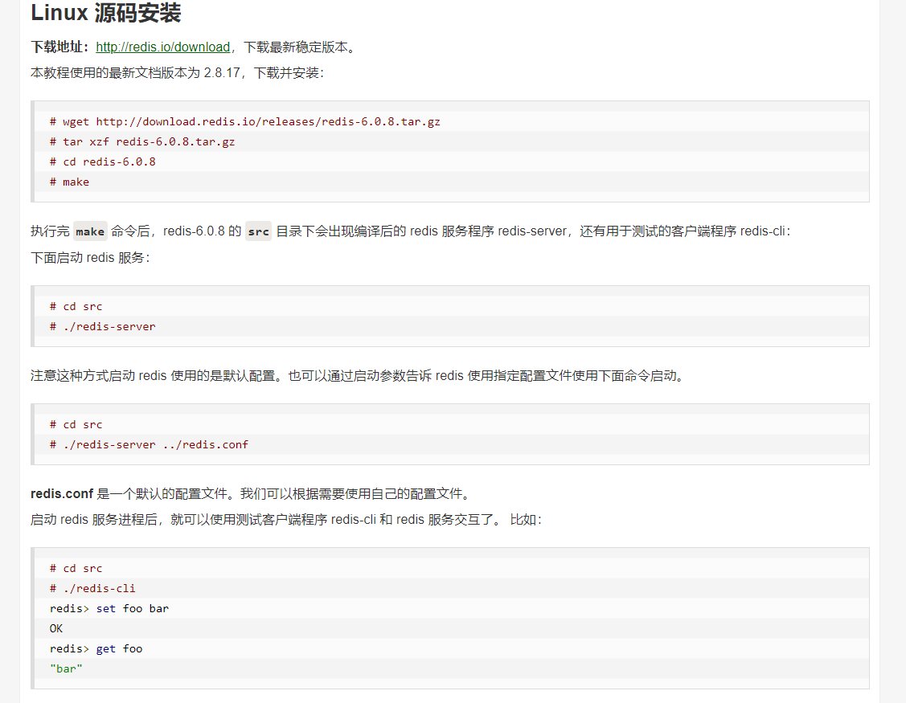
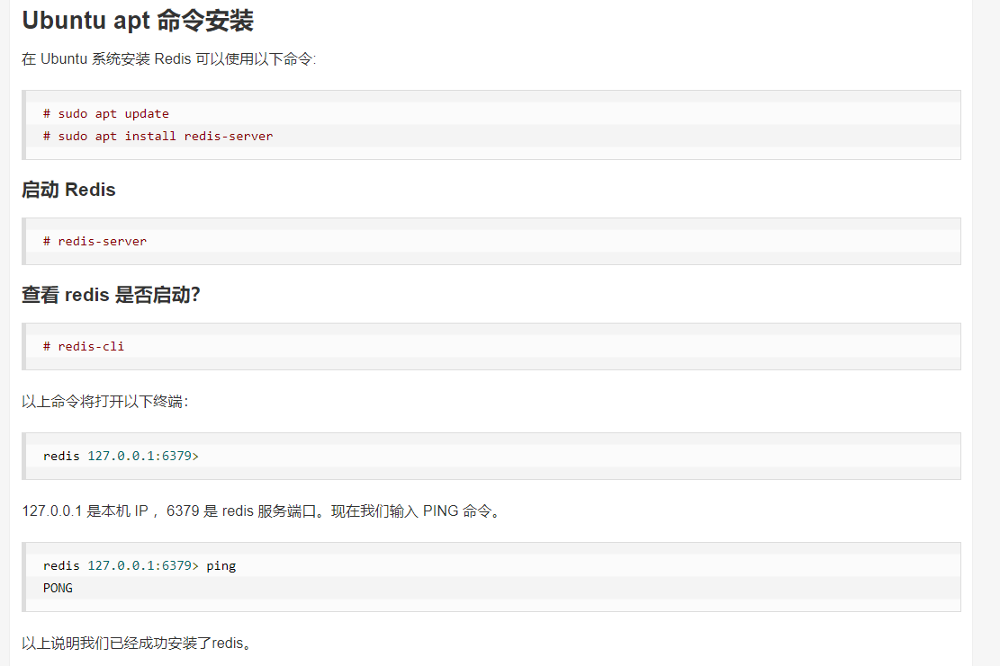
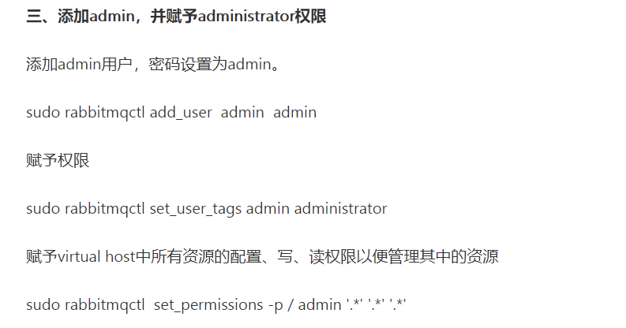
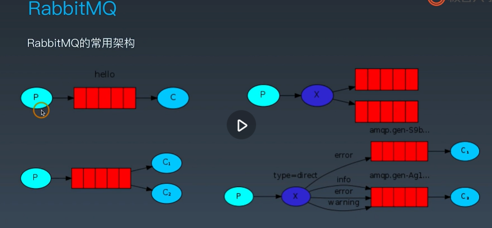

# WEEK05 中间件


## 为什么使用中间件 & 缓存的类别

用户量增加之后，单体没办法抗住比较大的用户请求

最常用的中间件就是**缓存和消息队列**

*企业级应用为什么需要缓存和消息队列?*

+   随着业务规模扩大，单体应用不再满足业务场景需求
+   用户数量剧增，单凭数据库无法抗住并发压力 (消息队列/MQTT)
+   业务场景复杂需要解耦
+   业务场景丰富造成访问热点(通过缓存机制降低数据库压力)


缓存通常工作在内存中，mysql一般放在磁盘里

缓存的分类：

+   本地缓存
+   分布式缓存

差异：调用方式、开销

**本地缓存的特点**：效率高，空间大小和本地内存大小有关，一般空间较小，一般放静态数据，配置文件或者配置数据

**分布式的缓存的特点**：要有网络的开销，空间较大，一般全局数据，多个业务模块之间共享的


## 缓存的同步方式有哪些


缓存




应用程序和缓存/数据库

1.  **Cache Aside**: 用户请求数据：先判断缓存中是否有数据，有则返回用户，没有则从数据库中读取出来，保存到缓存并返回给用户。

​					用户更新数据: 更新数据库，然后对缓存做一个更新

​	优点：实现简单

​	缺点： 对后台业务代码有侵入，必须知道数据缓存结构。

2.  **Write Through:** 对于应用程序认为只有数据库, 做一层封装，把缓存和数据库的处理通过类似ORM的方式封装起来，对于应用程序就是一体。

    优点：不需要管是否有缓存

    缺点：缓存和数据的更新逻辑需要自己去维护

3.   **Write Back:** 对于应用程序认为只有缓存。 应用程序只修改缓存，对于数据库不去管。需要自己做一个消息队列，当有缓存数据后，通过消息队列同步到数据库。

    优点：访问和返回的速度快

    缺点：异步读写容易出现数据丢失的风险，一致性容易出问题


缓存与数据库之间的同步的方式

1.  双写：好处：简单 ,延迟低速度快	坏处：容易造成数据不同步,耦合度最高

    解决不同步问题：引入 ==分布式事务==  ，定时通过读数据库同步缓存的数据

2.  消息队列方式：相对于双写效率低一些， 可以解决并发问题

3.  MySQL binlog: 使用MySQL binglog 重放同步到 Redis，延迟最高, 耦合度最低


| 方式         | 延迟性 | 耦合度 | 复杂度 |
| ------------ | ------ | ------ | ------ |
| 双写         | 最低   | 最高   | 最低   |
| 消息队列方式 | 居中   | 居中   | 居中   |
| MySQL binlog | 最高   | 最低   | 最高   |


## 缓存有可能出现的问题


架构中使用缓存有可能带来的问题？

+ 缓存穿透  （查询一个不存在的值, 导致每次都要从数据库中查询）

  办法：空值也进行一个缓存， 布隆过滤器

+ 缓存并发    (某一个key在某个时间点过期，恰好过期的时候有大量的并发请求到了这个key上面，会导致大量请求到数据库，区别与穿透这个请求值是正常的) 可以使用互斥锁 **SETNX** 的方法解决

+ 缓存雪崩    （同一时间缓存大量的key过期）缓存的时间上加上一点随机时间或者多级缓存

 

## 安装Redis、连接Redis

其实也类似mysql数据库，只是被用作缓存

Redis的特点:

+   使用IO多路复用机制
+   监听多个文件描述符实现读写事件
+   单工作线程(6.0以前)

注意：单工作线程可能会导致多个会话会相互干扰


Redis的对象类型

+   字符串
+   列表
+   哈希
+   集合
+   有序集合


目前比较稳定版本：redis-6.0.9.tar.gz

国外网站下载比较慢，可以使用这个网站下载: https://www.newbe.pro/Mirrors/Mirrors-Redis/


安装教程可以参考： https://www.runoob.com/redis/redis-install.html






先把redis.conf备份一份

建议开发环境可以这样修改redis.conf：

1. 790行 requirepass, 这个是链接redis所需要的密码，正式环境建议密码足够复杂

2. 68行 bind, 指绑定的IP， 改成0.0.0.0值监听所有的IP

```shell
./redis-server ../redis.conf
```


客户端应用程序可以执行:

```shell
./redis-cil -a 520123
```

-h ：主机名 -p：端口号 -a：密码


python连接redis:

```python
# python 连接redis
import redis

redis_server = '127.0.0.1'
redis_pass = '520123'

client = redis.Redis(host=redis_server, password='520123')

print(client.keys())

for key in client.keys():
    print(key.decode())

```


## Redis字符串

```python
# redis操作字符串
import redis

redis_server = '127.0.0.1'
redis_pass = '520123'

client = redis.Redis(host=redis_server, password='520123')

# 使用set遇到已存在的key也会覆盖
client.set('key', 'value')
# nx选项遇到已存在的key不会覆盖
client.set('key', 'value1', nx=True)

# 字符串后面追加
client.append('key', 'value4')

client.set('key2', '100')
result2 = client.incr('key2')  # 原有的值做加一的操作
print(result2)

result3 = client.decr('key2')  # 原有值做减一操作
print(result3)

result = client.get('key')
print(result)
print(result.decode())  # 转成字符串类型

# 不要贸然使用 keys * 指令， 会造成redis短暂不响应

```

nx=True 有存在的key不会覆盖

set设置值

get获取值

append追加值

incr 原有值加一

decr 原有值减一


## Redis列表

lpush:左插入数据

rpush:右插入数据

llen:列表长度

lpop:左弹出数据

rpop:右弹出数据

`lrange`： 查看一定范围的列表数据，一般==不能随便列出全部==，需要先判断列表是否很长


***可以当作队列去使用***

```python
# redis操作列表
import redis

redis_server = '127.0.0.1'
redis_pass = '520123'

client = redis.Redis(host=redis_server, password='520123')

# 插入数据
# client.lpush('list_redis_demo', 'python')
# client.rpush('list_redis_demo', 'java')

# 打印一下列表的长度
print(client.llen('list_redis_demo'))

# 弹出数据
# data = client.lpop('list_redis_demo')
# print(data)
# data = client.rpop('list_redis_demo')
# print(data)

# 查看一定范围的list数据
data = client.lrange('list_redis_demo', 0, -1)
print(data)

```


## Redis集合

数据不重复

使用于去重，或者交集 并集 差集

```python
# redis操作集合
import redis

redis_server = '127.0.0.1'
redis_pass = '520123'

client = redis.Redis(host=redis_server, password='520123')

# 第一次添加打印值为1 后面添加返回值为0
print(client.sadd('redis_set_demo', 'new_data'))

# 随机弹出一个数据
# client.spop()

# 查看所有值
print(client.smembers('redis_set_demo'))

# 集合的交集
client.sinter('set_a', 'set_b')

# 集合的并集
client.sunion('set_a', 'set_b')

# 集合的差集
client.sdiff('set_a', 'set_b')

```


## Redis 哈希

相对于redis字符串存储更省空间

```python
# redis操作哈希
import redis

redis_server = '127.0.0.1'
redis_pass = '520123'

client = redis.Redis(host=redis_server, password='520123')

# 添加
# client.hset('vip_user', '1001', 1)
# client.hset('vip_user', '1002', 1)

# # 删除
# client.hdel('vip_user', '1002')

# # 检查是否存在
# print(client.hexists('vip_user', '1002'))

# # 添加多个键值对
# client.hmset('vip_user', {'1003': 1, '1004': 1})

# hkeys hget hmget hgetall
# hkeys用于获取所有的字段名
# hget获取一个字段
# hmget获取多个字段
# 获取一个哈希表中的所有字段
# 返回值都是bytes，需要decode转换类型
field = client.hkeys('vip_user')
print(field)
print(client.hget('vip_user', '1001'))
print(client.hgetall('vip_user'))

```


## Redis 有序集合

一般用于评分和排序上

```python
# redis操作有序集合
import redis

redis_server = '127.0.0.1'
redis_pass = '520123'

client = redis.Redis(host=redis_server, password='520123')

# 添加数据
client.zadd('rank', {'a': 4, 'b': 3, 'c': 1, 'd': 2, 'e': 5})

# 值减操作
client.zincrby('rank', -2, 'e')

# 按照评分 从小到大 查看
print(client.zrangebyscore('rank', 1, 5))
# 从大到小 zrevrank

# 基card 有多少个值
print(client.zcard('rank'))

# 显示评分 从小到大
print(client.zrange('rank', 0, -1, withscores=True))
# 显示评分 从大到小
print(client.zrevrange('rank', 0, -1, withscores=True))

```


## Redis的重要机制

一般放热数据，频繁访问，极少发生修改

+ 生存时间 - 定期清除、惰性清除、 LRU(优先淘汰不是最近使用的数据)、LFU(优先淘汰不频繁使用的数据，占用的资源会多一点，每个数据都需要一个计数器)
+ 主从复制 （对于应用程序一般主服务器上读写，从服务器只能读），只能支持一主多从
+ 哨兵 （仲裁设置成奇数值）
  + 1.监控主从服务器是不是正确运行 
  + 2.通知，主从服务器出问题的时候可以通过API向管理员或者其他应用程序发起通知 
  + 3.自动故障迁移。当一个主服务出问题了， 会把一个从服务器升级为新主服务器


## 消息队列的用途

连接和缓存的作用

计算机中的消息队列有什么用途：

+ 异步处理
+ 流量控制 
+ 服务解耦


消息队列的模型：

+ 队列模型
+ 发布-订阅模型


## RabbitMQ的主要结构

AMQP协议与RabbitQMQ软件

+ RabbitMQ是AMQP的代理服务器
+ RabbitMQ提供了一套严格的通信方式，通信的各个方面几乎都采用了远程过程调用

ubuntu上安装

```shell
sudo apt-get install erlang-nox
sudo apt-get install rabbitmq-server
```

wsl会运行不起来，可以使用以下办法, 需要修改配置文件，打开默认监听的端口号

```
	    9
l669306630   2019-05-08 17:12:29 +08:00   ❤️ 3
问题解决了

问题是，在 Windows PowerShell 中查看端口
> netstat -ano | findstr 5672
> TCP 0.0.0.0:5672 0.0.0.0:0 LISTENING 6212

解决办法：
vi 安装目录 /etc/rabbitmq/rabbitmq.conf
新增：listeners.tcp.default = 5672
新增：listeners.tcp.local = 127.0.0.1:5672

再启动服务
安装目录 /sbin/rabbitmq-server

再回 Windows PowerShell 中查看端口
> netstat -ano | findstr 5672
> TCP 0.0.0.0:5672 0.0.0.0:0 LISTENING 6212
> TCP 127.0.0.1:5672 0.0.0.0:0 LISTENING 6212
```

我的是rabbitmq-env.conf文件， 把一些屏蔽的打开


默认会安装一个插件可以使用起来，打开后可以通过网页去访问rabbitmq

```shell
sudo  rabbitmq-plugins enable rabbitmq_management
```

windows下查看端口

```powershell
netstat -ano | findstr 5672
```


启动、停止、重启、状态rabbitMq命令

```shell
sudo rabbitmq-server start
sudo rabbitmqctl stop
sudo rabbitmq-server stop
sudo rabbitmq-server restart
sudo rabbitmqctl status
```

工作端口是5672

浏览器访问 http://localhost:15672/

默认用户名和密码都是 guest

需要去修改账号密码




交换机支持：一对一、一对多、多对一	三种形式


## RabbitMQ的队列方式用法

python需要安装pika包  pip install pika



p:生产者 

x:交换机

红色:队列

c：消费者


相比于python队列带了一个持久化的功能，消息会保存在硬盘中


生产者代码:

```python
# 生产者代码
import pika

MQHost = '127.0.0.1'

# 用户名和密码
# 尽量给不同的业务分配不同的 账号和密码
credentials = pika.PlainCredentials('guest', 'guest')

# 虚拟队列需要指定参数 virtual_host, 如果是默认的可以不填
parameters = pika.ConnectionParameters(host=MQHost,
                                        port=5672,
                                        virtual_host='/',
                                        credentials=credentials)
# 阻塞方法
connection = pika.BlockingConnection(parameters)


# 建立信道
channel = connection.channel()

# 声明消息队列
# 生产者和消费者都可以声明，尽量两边都声明，防止报错，如不存在自动创建
# durable=True 队列持久化 是否保存到硬盘上
channel.queue_declare(queue='direct_demo', durable=False)

# exchange指定交换机
# routing_key指定队列名
channel.basic_publish(exchange='', routing_key='direct_demo',
                    body='send message to rabbitmq')

# 关闭与rabbitmq server的连接
connection.close()
```


消费者代码:

```python
# 消费者代码
import pika

MQHost = '127.0.0.1'

# 用户名和密码
# 尽量给不同的业务分配不同的 账号和密码
credentials = pika.PlainCredentials('guest', 'guest')

# 虚拟队列需要指定参数 virtual_host, 如果是默认的可以不填
parameters = pika.ConnectionParameters(host=MQHost,
                                       port=5672,
                                       virtual_host='/',
                                       credentials=credentials)

# 阻塞方法
connection = pika.BlockingConnection(parameters)


# 建立信道
channel = connection.channel()

# 声明消息队列
# 生产者和消费者都可以声明，尽量两边都声明，防止报错，如不存在自动创建
# durable=True 队列持久化 是否保存到硬盘上
channel.queue_declare(queue='direct_demo', durable=False)

# 定义一个回调函数来处理消息队列中的消息


def callback(ch, method, properties, body):

    # 手动发送确认消息
    ch.basic_ack(delivery_tag=method.delivery_tag)
    # 实现如何处理消息
    print(body.decode())


# 消费者使用队列和那个回调函数处理消息
channel.basic_consume('direct_demo', on_message_callback=callback)

# 开始接收消息，并进入阻塞状态
channel.start_consuming()

```


## RabbitMQ订阅发布模型的用法

一个生产者无交换机多个消费者:

生产者代码:

```python
# 生产者代码
# 订阅发布
import pika

MQHost = '127.0.0.1'

# 用户名和密码
# 尽量给不同的业务分配不同的 账号和密码
credentials = pika.PlainCredentials('guest', 'guest')

# 虚拟队列需要指定参数 virtual_host, 如果是默认的可以不填
parameters = pika.ConnectionParameters(host=MQHost,
                                       port=5672,
                                       virtual_host='/',
                                       credentials=credentials)
# 阻塞方法
connection = pika.BlockingConnection(parameters)


# 建立信道
channel = connection.channel()

# 声明消息队列
# 生产者和消费者都可以声明，尽量两边都声明，防止报错，如不存在自动创建
# durable=True 队列持久化 是否保存到硬盘上
channel.queue_declare(queue='task_queue', durable=True)

message = 'send message to taskqueue'
# exchange指定交换机
# routing_key指定队列名
channel.basic_publish(exchange='',
                      routing_key='task_queue',
                      body=message,
                      properties=pika.BasicProperties(
                          delivery_mode=2,  # 消息持久化, 不同于队列持久化
                      ))


# 关闭与rabbitmq server的连接
connection.close()

```


消费者代码：

```python
# 消费者
# 订阅发布
import time
import pika

MQHost = '127.0.0.1'

# 用户名和密码
# 尽量给不同的业务分配不同的 账号和密码
credentials = pika.PlainCredentials('guest', 'guest')

# 虚拟队列需要指定参数 virtual_host, 如果是默认的可以不填
parameters = pika.ConnectionParameters(host=MQHost,
                                       port=5672,
                                       virtual_host='/',
                                       credentials=credentials)

# 阻塞方法
connection = pika.BlockingConnection(parameters)


# 建立信道
channel = connection.channel()

# 声明消息队列
# 生产者和消费者都可以声明，尽量两边都声明，防止报错，如不存在自动创建
# durable=True 队列持久化 是否保存到硬盘上
channel.queue_declare(queue='task_queue', durable=True)

# 定义一个回调函数来处理消息队列中的消息


def callback(ch, method, properties, body):

    time.sleep(1)
    # 实现如何处理消息
    print(body.decode())
    # 手动发送确认消息
    ch.basic_ack(delivery_tag=method.delivery_tag)


# 如果该消费者的channel上未确认的消息数达到了prefetch_count数，则不向消费者发送消息
channel.basic_qos(prefetch_count=1)

# 消费者使用队列和那个回调函数处理消息
channel.basic_consume('task_queue', callback)

# 开始接收消息，并进入阻塞状态
channel.start_consuming()

```


使用交换机方式一对多

生产者代码：

```python
# 生产者代码
# 订阅发布 有交换机
import pika

MQHost = '127.0.0.1'

# 用户名和密码
# 尽量给不同的业务分配不同的 账号和密码
credentials = pika.PlainCredentials('guest', 'guest')

# 虚拟队列需要指定参数 virtual_host, 如果是默认的可以不填
parameters = pika.ConnectionParameters(host=MQHost,
                                       port=5672,
                                       virtual_host='/',
                                       credentials=credentials)
# 阻塞方法
connection = pika.BlockingConnection(parameters)


# 建立信道
channel = connection.channel()

# 定义交换机
# fanout指的一对多的方式
channel.exchange_declare(exchange='logs', exchange_type='fanout')

message = 'send message to fanout'
# exchange指定交换机
# routing_key指定队列名
channel.basic_publish(exchange='logs',
                      routing_key='',
                      body=message,
                      )


# 关闭与rabbitmq server的连接
connection.close()

```

消费者代码：

```python
# 消费者
# 订阅发布 交换机模式
import time
import pika

MQHost = '127.0.0.1'

# 用户名和密码
# 尽量给不同的业务分配不同的 账号和密码
credentials = pika.PlainCredentials('guest', 'guest')

# 虚拟队列需要指定参数 virtual_host, 如果是默认的可以不填
parameters = pika.ConnectionParameters(host=MQHost,
                                       port=5672,
                                       virtual_host='/',
                                       credentials=credentials)

# 阻塞方法
connection = pika.BlockingConnection(parameters)


# 建立信道
channel = connection.channel()

# 声明交换机
channel.exchange_declare(exchange='logs',
                         exchange_type='fanout')

# 声明消息队列
# exclusive当与消费者断开连接的时候，队列被立即删除
result = channel.queue_declare(queue='',
                               exclusive=True)

queue_name = result.method.queue

# 通过bind实现exchange将message发送到指定的queue
channel.queue_bind(exchange='logs',
                   queue=queue_name)


# 定义一个回调函数来处理消息队列中的消息
def callback(ch, method, properties, body):

    # 实现如何处理消息
    print(body.decode())
    # 手动发送确认消息
    # ch.basic_ack(delivery_tag=method.delivery_tag)


# 如果该消费者的channel上未确认的消息数达到了prefetch_count数，则不向消费者发送消息
channel.basic_qos(prefetch_count=1)

# 消费者使用队列和那个回调函数处理消息
channel.basic_consume(queue=queue_name,
                      on_message_callback=callback,
                      auto_ack=True)  # 自动确认消息

# 开始接收消息，并进入阻塞状态
channel.start_consuming()

```


## 消息队列经常遇到的三个问题

生产级消息队列重要的三个问题：

+ 如何保证事务在分布式消息队列的一致性？
+ 如何保证消息不会丢？
+ 如何处理重复消息？


## RPC和gRPC的使用

RPC：远程过程调用

gRPC:gRpc是Google发布的基于HTTP2.0传输层协议承载的高性能开源软件框架。

特点：

+ 基于HTTP协议
+ 开源
+ 支持多语言
+ 通过Protocol Buffers 编写proto文件，交换机与服务器建立gRPC通道


Protocol Buffers的作用：

+ 定义数据结构
+ 定义服务接口
+ 序列化和反序列化

```python
# grpcio 是启动gRPC 服务的项目依赖
# pip install grpcio -i http://pypi.douban.com/simple/ --trusted-host pypi.douban.com
# gRPC tools 包含 protocol buffer 编译器和用于从.proto 文件生成服务端和哭护短代码的插件
# pip install grpcio-tools -i http://pypi.douban.com/simple/ --trusted-host pypi.douban.com
# 升级protobuf
# pip install --upgrade protobuf -i https://pypi.douban.com/simple
```


1. 写好proto文件

```protobuf
syntax = "proto3";

package schema;

service Gateway {
    rpc Call(stream Request) returns (stream Response){}
}

message Request {
    int64 num = 1;
}

message Response {
    int64 num = 1;
}
```

2. 通过命令使用工具把proto文件转为py文件

   ```powershell
   python.exe -m grpc_tools.protoc -I ./ --python_out=. --grpc_python_out=. ./schema.proto
   ```

   生成了schema_pb2.py 和 schema_pb2_grpc.py