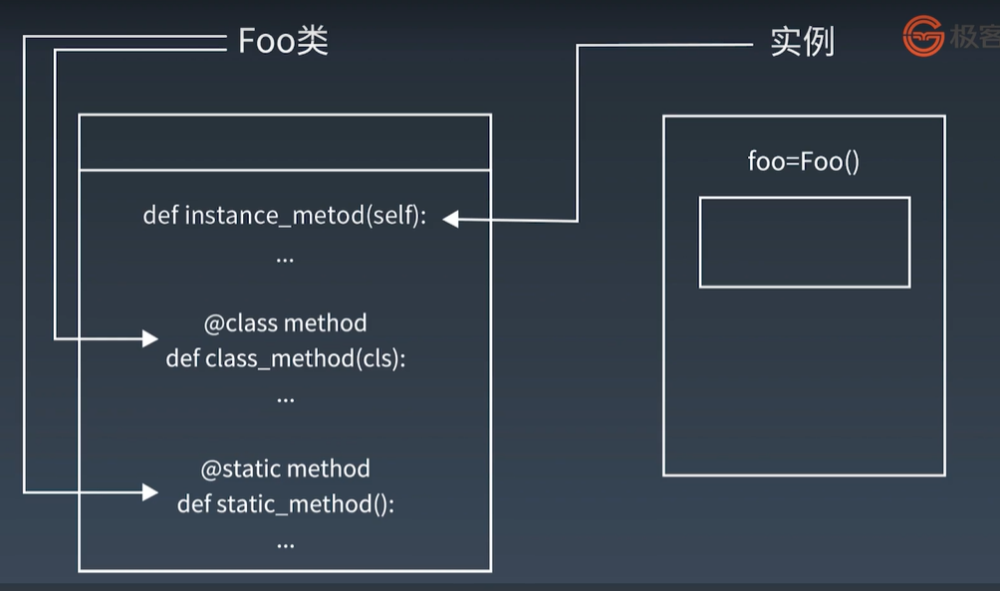
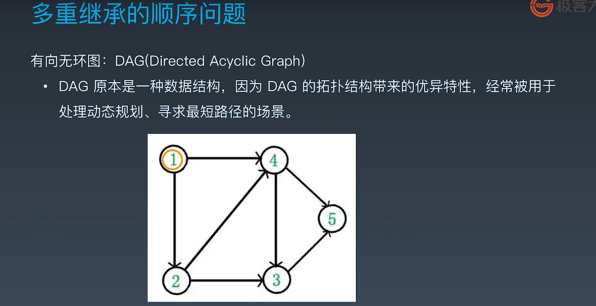

# WEEK06面向对象编程


## 类属性和对象属性


python中把类定义成对象


面向对象编程:

+ 现实世界的对象和python世界的对象
+ 对象是一个数据以及相关行为的集合
+ python的经典类和新式类
+ 类的两大成员：属性和方法


属性：

+ 类属性与对象属性 ：类属性在内存中只保留一份，对象属性每创建一个对象都保存一份
+ 类属性字段在内存中只保留一份
+ 对象属性在每个对象中都保存一份


类`.__dict__` 的方式可以查看类下面定义的变量

或者 dir(类)也能看

```python
# 类

class Human(object):
    # 静态字段
    live = True

    def __init__(self, name):
        # 普通字段
        self.name = name


man = Human('Adam')
woman = Human('Eve')


# 有静态字段, live属性
Human.__dict__
# 有普通字段， name属性
man.__dict__

# 实例可以使用普通字段也可以使用静态字段
man.name
man.live = False  # 创建了对象的属性
# 查看实例属性
man.__dict__  # 普通字段有live变量
man.live
woman.live  # 类的属性

# 类可以使用静态字段
Human.live

# 可以为类添加静态字段
Human.newattr = 1

```


```python

class MyFirstClass:
    pass


a = MyFirstClass()
b = MyFirstClass()

# 不同内存地址，两个不同对象
type(a)
id(a)
id(b)
a.__class__()
b.__class__()

# 类也是对象
c = MyFirstClass
d = c()
d.__class__()

```


## 类的属性作用域


```python
# 类

class Human(object):
    # 静态字段
    live = True

    def __init__(self, name):
        # 普通字段
        self.name = name


man = Human('Adam')
woman = Human('Eve')


# 有静态字段, live属性
Human.__dict__
# 有普通字段， name属性
man.__dict__

# 实例可以使用普通字段也可以使用静态字段
man.name
man.live = False  # 创建了对象的属性
# 查看实例属性
man.__dict__  # 普通字段有live变量
man.live
woman.live  # 类的属性

# 类可以使用静态字段
Human.live

# 可以为类添加静态字段
Human.newattr = 1
dir(Human)
Human.__dict__

# 内置类型不能增加属性和方法
setattr(list, 'newattr', 'value')  # 相当于 list.newattr = 'value'
# TypeError

# 显示object类的所有子类
# ().__class__.__bases__[0] 表示object
print(().__class__.__bases__[0].__subclasses__())

```

`.__subclasses__` 取得子类


```python
class Human2(object):
    # 人为约定不可修改
    _age = 0

    # 私有属性
    __fly = False

    # 魔术方法，不会自动改名
    # 如__init__


# 自动改名机制
Human2.__dict__

```


## 类方法描述器

语法糖

@classmethod 类的方法

@staticmethod 静态方法




三种方法：

+ 普通方法 至少一个self参数，表示该方法的对象
+ 类方法 至少一个cls参数，表示该方法的类
+ 静态方法 由类调用，无参数

三种方法在内存中都归属于类


`__init__`是初始化函数

`__new__`才是默认唯一的构造函数


```python
    # 初始化函数, 第一个参数必须是self，
    # 后面的参数代表是这个类可以去接收的参数
    def __init__(self, name):
        self.name = name
```

self是实例的名字， cls是类的名字

### @classmethod的用处:

其实是构造函数

1. 可以在父类中定义，子类继承之后，classmethod的类的名字就会随着变化 
2. 函数调用类并且返回类的时候(cls) 

```python
# 让实例的方法称为类的方法
class K1s1(object):
    bar = 1

    def foo(self):
        print('in foo')

    # 使用类属性、方法

    @classmethod
    def class_foo(cls):
        print(cls.bar)
        print(cls.__name__)
        cls().foo()


# 没有实例化，直接使用类的方法
K1s1.class_foo()


#################################
class Story(object):
    snake = 'Python'

    # 初始化函数, 第一个参数必须是self(实例的名字)，
    # 后面的参数代表是这个类可以去接收的参数
    def __init__(self, name):
        self.name = name

    # 类的方法
    @classmethod
    def get_apple_to_eve(cls):
        return cls.snake


s = Story('anyone')
# get_apple_to_eve 是bound方法，查找顺序是先找s的__dict__是否有get_apple_to_eve,
# 如果没有，查类Story
print(s.get_apple_to_eve)
# 类和实例都可以使用
print(s.get_apple_to_eve())
print(Story.get_apple_to_eve())


##################################
class Kls2():
    def __init__(self, fnmae, lname):
        self.fname = fnmae
        self.lname = lname

    def print_name(self):
        print(f'first name is {self.fname}')
        print(f'last name is {self.lname}')


me = Kls2('wilson', 'yin')
me.print_name()


#  输入改为 wilson-yin
# 解决办法1: 修改__init__()
# 解决办法2: 增加__new__() 构造函数
# 解决方法3: 增加 提前处理的函数

# 解决方法3：
def pre_name(obj, name):
    fname, lname = name.split('-')
    return obj(fname, lname)


me2 = pre_name(Kls2, 'wilson-yin')
me2.print_name()


###########################
class Kls3():
    def __init__(self, fnmae, lname):
        self.fname = fnmae
        self.lname = lname

    @classmethod
    def pre_name(cls, name):
        fname, lname = name.split('-')
        return cls(fname, lname)

    def print_name(self):
        print(f'first name is {self.fname}')
        print(f'last name is {self.lname}')


me3 = Kls3.pre_name('wilson-yin')
me3.print_name()


###############################
class Fruit(object):
    total = 0

    @classmethod
    def print_total(cls):
        print(cls.total)
        print(id(Fruit.total))
        print(id(cls.total))

    @classmethod
    def set(cls, value):
        print(f'calling {cls} , {value}')
        cls.total = value


class Apple(Fruit):
    pass


class Orange(Fruit):
    pass


Apple.set(100)
# calling <class '__main__.Apple'> , 100
Orange.set(200)
# calling <class '__main__.Orange'> , 200
org = Orange()
org.set(300)
# calling <class '__main__.Orange'> , 300

Apple.print_total()
# 100
# 140726992796704
# 140726992799904

Orange.print_total()
# 300
# 140726992796704
# 2368327336944

```


## 静态方法描述器 staticmethod

不带任何参数，不带self和cls

多数是用于一些功能的转化，参数的转化

```python
import datetime


class Story(object):
    snake = 'Python'

    def __init__(self, name):
        self.name = name

    # 静态方法
    @staticmethod
    def god_come_go():
        if not datetime.datetime.now().month % 2:
            print('god is coming')


Story.god_come_go()

```


## 描述器高级应用`__getatteribute__`

可以用于判断属性是否存在，不存在则创建这个属性，防止抛出异常

**属性的处理：**

在类中，需要对`实例`获取属性这一行为进行操作，可以使用：

+ `__getattribute__()`
+ `__getattr__()`

异同：

+ 都可以对实例属性进行获取拦截
+ `__getattr__()`适用于未定义的属性
+ `__getattribute__()`对所有属性的访问都会调用该方法

```python
# GOD
class Human(object):
    def __init__(self, name):
        self.name = name


h1 = Human('Adam')
h2 = Human('Eve')

# 对实例属性做修改
h1.name = 'python'

# 对实例属性查询
h1.name

# 删除实例属性
del h1.name

# AttributeError 访问不存在的属性
# 由__getattribute__(self, name)抛出
# h1.name

#############


class Human2(object):
    '''
    getattribute对任意读取的属性进行拦截
    '''

    def __init__(self):
        self.age = 18

    def __getattribute__(self, item):
        print(f'__getattribute__called item:{item}')
        try:
            return super().__getattribute__(item)
        except Exception as e:
            self.__dict__[item] = 100
            return 100


h1 = Human2()

h1.age
print(h1.noattr)

```


## 描述器高级应用 `__getattr__`

当属性不存在的时候，才会调用`__getattr__`

```python
class Human2(object):
    '''
    属性不在实例的__dict__中，__getattr__被调用
    '''

    def __init__(self):
        self.age = 18

    def __getattr__(self, item):
        print(f'__getattr__ called item:{item}')
        # 不存在的属性返回默认值'Ok'
        return 'OK'


h1 = Human2()

print(h1.age)
print(h1.noattr)

```

```python
class Human2(object):
    '''
    属性不在实例的__dict__中，__getattr__被调用
    '''

    def __init__(self):
        self.age = 18

    def __getattr__(self, item):
        # 对指定属性做处理：fly属性返回'superman', 其他属性返回None
        self.item = item
        if self.item == 'fly':
            return 'superman'


h1 = Human2()

print(h1.age)
print(h1.fly)
print(h1.noattr)

```

getattr和getattrbuite的执行顺序

如果同时存在，执行顺序是 `__getattribute__ > __getattr__ > __dict__`

```python
class Human2(object):
    '''
    属性不在实例的__dict__中，__getattr__被调用
    '''

    def __init__(self):
        self.age = 18

    def __getattr__(self, item):
        print('Human2:__getattr__')
        return 'Err 404, 你请求的参数不存在'

    def __getattribute__(self, item):
        print('Human2:__getattribute__')
        return super().__getattribute__(item)


h1 = Human2()

# 如果同时存在，执行顺序是 __getattribute__ > __getattr__ > __dict__
print(h1.age)
print(h1.noattr)
# 注意输出， noattr的调用顺序

```


## 描述器原理 & 属性描述符

属性描述符 property

描述器: 实现特定协议(描述符)的类

property类需要实现  `__get__`   `__set__` `__delete__`方法

使用@property的时候相当于把函数变成了属性

 ```python
class Teacher:
    def __init__(self, name):
        self.name = name
        
    def __get__(self):
        return self.name
    
    def __set__(self, value):
        self.name = value
        
pythonteacher = Teacher('yin')        
 ```


```python
# __getattribute__ 的底层原理是描述器
class Desc(object):
    '''
    通过打印来展示描述器的访问流程
    '''

    def __init__(self, name):
        self.name = name

    # owner表示属于哪个类
    def __get__(self, instance, owner):
        print(f'__get__{instance} {owner}')
        return self.name

    def __set__(self, instance, value):
        print(f'__set__{instance} {value}')
        self.name = value

    def __delete__(self, instance):
        print(f'__delete__ {instance}')
        del self.name


class MyObj(object):
    a = Desc('aaa')
    b = Desc('bbb')


my_object = MyObj()
print(my_object.a)

my_object.a = 456
print(my_object.a)

```


\# 另一种property写法

\# gender = property(get__, set__, del__, 'other propetry')


\# 被修饰函数建议使用相同的gender2（函数名）

\# 使用setter 并不能真正意义上实现无法写入, gender被改名为 _Article_gender


\# property本质并不是函数， 二十特殊类(实现了数据描述符的类)

\# 如果一个对象同时定义了__get__()和__set__()方法, 则成为数据描述符

\# 如果仅定义了__get__()的方法，则成为非数据描述符


\# property的优点:

\# 1 代码更简洁、可读性、可维护性更强

\# 2 更好的管理属性的访问

\# 3 控制属性访问权限、提高数据安全性


```python
# GOD
class Human(object):
    def __init__(self, name):
        self.name = name

    # 将方法封装成属性
    @property
    def gender(self):
        return 'M'


h1 = Human('Adam')
h2 = Human('Eve')
h1.gender

# AttributeError:
h2.gender = 'F'


###########################

class Human(object):
    def __init__(self):
        self._gender = None

    # 将方法封装成属性
    @property
    def gender2(self):
        return 'M'

    # 支持修改
    @gender2.setter
    def gender2(self, value):
        self._gender = value

    # 支持删除
    @gender2.deleter
    def gender2(self):
        del self._gender


h = Human()
h.gender = 'F'
h.gender
del h.gender
# 另一种property写法
# gender = property(get__, set__, del__, 'other propetry')

# 被修饰函数建议使用相同的gender2（函数名）
# 使用setter 并不能真正意义上实现无法写入, gender被改名为 _Article_gender


# property本质并不是函数， 二十特殊类(实现了数据描述符的类)
# 如果一个对象同时定义了__get__()和__set__()方法, 则成为数据描述符
# 如果仅定义了__get__()的方法，则成为非数据描述符

# property的优点:
# 1 代码更简洁、可读性、可维护性更强
# 2 更好的管理属性的访问
# 3 控制属性访问权限、提高数据安全性

```


```python
# GOD
class Human(object):
    def __init__(self, name):
        self.name = name

    # 将方法封装成属性
    @property
    def gender(self):
        return 'M'


h1 = Human('Adam')
h2 = Human('Eve')
h1.gender

# AttributeError:
h2.gender = 'F'


###########################

class Human(object):
    def __init__(self):
        self._gender = None

    # 将方法封装成属性
    @property
    def gender2(self):
        return 'M'

    # 支持修改
    @gender2.setter
    def gender2(self, value):
        self._gender = value

    # 支持删除
    @gender2.deleter
    def gender2(self):
        del self._gender


h = Human()
h.gender = 'F'
h.gender
del h.gender
# 另一种property写法
# gender = property(get__, set__, del__, 'other propetry')

# 被修饰函数建议使用相同的gender2（函数名）
# 使用setter 并不能真正意义上实现无法写入, gender被改名为 _Article_gender


# property本质并不是函数， 二十特殊类(实现了数据描述符的类)
# 如果一个对象同时定义了__get__()和__set__()方法, 则成为数据描述符
# 如果仅定义了__get__()的方法，则成为非数据描述符

# property的优点:
# 1 代码更简洁、可读性、可维护性更强
# 2 更好的管理属性的访问
# 3 控制属性访问权限、提高数据安全性

#############################
# property 纯python实现

class Property(object):
    "Emulate PyProperty_Type() in Objects/descrobject.c"

    def __init__(self, fget=None, fset=None, fdel=None, doc=None):
        self.fget = fget
        self.fset = fset
        self.fdel = fdel
        if doc is None and fget is not None:
            doc = fget.__doc__
            self.__doc__ = doc

    def __get__(self, obj, objtype=None):
        if obj is None:
            return self
        if self.fget is None:
            raise AttributeError("unreadable attribute")
        return self.fget(obj)

    def __set__(self, obj, value):
        if self.fset is None:
            raise AttributeError("can't set attribute")
        self.fset(obj, value)

    def __delete__(self, obj):
        if self.fdel is None:
            raise AttributeError("can't delete attribute")
        self.fdel(obj)

    def getter(self, fget):
        return type(self)(fget, self.fset, self.fdel, self.__doc__)

    def setter(self, fset):
        return type(self)(self.fget, fset, self.fdel, self.__doc__)

    def deleter(self, fdel):
        return type(self)(self.fget, self.fset, fdel, self.__doc__)

```


## 面向对象编程-继承

封装、继承、重载以及多态

单继承、多继承

所有的类都继承于一个基类 object

type类是用来创建类的


新式类和经典类的区别：

+ 当前类或者费雷继承了object类，那么该类便是新式类，否者便是经典类


object和type的关系

+ object和type都属于type类(class'type')
+ type类由type元类自身创建的。 object类是由元类type创建
+ object的父类为空，没有继承任何类
+ type的父类为object类(class'object')


类的继承：

+ 单一继承 ： 子类有一个父类
+ 多重继承：A类下面有个B类，B类下面有个C类
+ 菱形继承(钻石继承)
+ 继承机制MRO
+ MRO的C3算法 : 个人理解，广度优先加启发式搜索(优先遍历入度小的)


```python
# 父类
class People(object):
    def __init__(self):
        self.gene = 'XY'

    def walk(self):
        print('I can walk')


# 子类
class Man(People):
    def __init__(self, name):
        self.name = name

    def work(self):
        print('work hard')


class Woman(People):
    def __init__(self, name):
        self.name = name

    def shopping(self):
        print('buy buy buy')


p1 = Man('Adam')
p2 = Woman('Eve')
```

对于上面代码：

\# 问题1 gene有没有被继承？

p1.gene

#答：没有被继承, 可以使用super().__init__

\# 问题2 People的父类是谁？

#答：object


\# 问题3 能否实现多重层级继承

\# 答：可以


\# 问题4 能否实现多个父类同时继承

\# 答： 可以


super():

```python
# 父类
class People(object):
    def __init__(self, name):
        self.gene = 'XY'
        # 假设人人都有名字
        self.name = name

    def walk(self):
        print('I can walk')


# 子类
class Man(People):
    def __init__(self, name):
        # 找到Man的父类People， 把类People的对象转换Man的对象
        super().__init__(name)

    def work(self):
        print('work hard')


def Woman(People):
    def __init__(self, name):
        super().__init__(name)

    def shopping(self):
        print('buy buy buy')


p1 = Man('Adam')
p2 = Woman('Eve')

# 问题1 gene有没有被继承？
# super().__init__(name)
p1.gene

# 问题2 People的父类是谁？
# object 与 type
print('object', object.__class__, object.__bases__)
print('type', type.__class__, type.__bases__)
# type元类是由type自身创建， object类由元类type创建
# type类继承了objcect

# 问题3 能否实现多重层级继承
# 可以


# 问题4 能否实现多个父类同时继承
# 可以
class Son(Man, Woman):
    pass

```


菱形继承(砖石继承)：

```python
# 钻石继承
class BaseClass(object):
    num_base_calls = 0
    def call_me(self):
        print ("Calling method on Base Class")
        self.num_base_calls += 1

class LeftSubclass(BaseClass):
    num_left_calls = 0
    def call_me(self):
        print ("Calling method on Left Subclass")
        self.num_left_calls += 1

class RightSubclass(object):
    num_right_calls = 0
    def call_me(self):
        print("Calling method on Right Subclass")
        self.num_right_calls += 1

class Subclass(LeftSubclass,RightSubclass):
    pass

a = Subclass()
a.call_me()

print(Subclass.mro())
# 广度优先， 另外Python3 中不加(object)也是新式类，但是为了代码不会误运行在python2下产生意外结果，仍然建议增加
# >>> Subclass.mro()
# [<class '__main__.Subclass'>, <class '__main__.LeftSubclass'>, <class '__main__.RightSubclass'>, <class '__main__.BaseClass'>, <class 'object'>]

#  修改RightSubclass 的 父类为 Object
# >>> Subclass.mro()
# [<class '__main__.Subclass'>, <class '__main__.LeftSubclass'>, <class '__main__.BaseClass'>, <class '__main__.RightSubclass'>, <class 'object'>]


```

通过.mro()可以看到继承的关系





python中没有实现重载功能


## solid设计原则与设计模式&单例模式

SOLID设计原则

+ 单一责任原则 The Single Responsibility Principle
+ 开放封闭原则 The Open Closed Principle
+ 里氏替换原则 The Liskov Substitution Principle
+ 依赖倒置原则 The Dependency Inversion Principle
+ 接口分离原则 The Interface Segregation Principle


单例模式：

1. 对象只存在一个实例
2. `__init__`和 `__new__`的区别：
   + `__new__`是实例创建之前被调用，返回该实例对象，是静态方法(staticmethod)
   + `__init__`是实例对象创建完成后被调用，是实例方法
   + `__new__`先被调用，`__init__`后被调用
   + `__new__`的返回值(实例)将传递给`__init__`方法的第一个参数, `__init__`给这个实例设置相关参数


三种单实例方法:

1. 装饰器
2. `__new__`的方式
3. import的方式

```python
# 装饰器实现单实例模式
import World


def singleton(cls):
    instances = {}

    def getinstance():
        if cls not in instances:
            instances[cls] = cls()
        return instances[cls]
    return getinstance


@singleton
class MyClass:
    pass


m1 = MyClass()
m2 = MyClass()
# 两个id是一样
print(id(m1))
print(id(m2))


############################
# __new__ 与 __init__的关系
class Foo(object):
    def __new__(cls, name):
        print('trace __new__')
        return super().__new__(cls)

    def __init__(self, name):
        print('trace __init__')
        super().__init__()
        self.name = name


bar = Foo('test')
bar.name


###############################
# __new__方式实现单实例模式
class Singleton2(object):
    __isintance = False  # 默认没有被实例化

    def __new__(cls, *args, **kwargs):
        if cls.__isintance:
            return cls.__isintance  # 返回实例化对象
        cls.__isintance = object.__new__(cls)  # 实例化
        return cls.__isintance
# 以上会存在线程安全的问题


# 方法1，实现__new__方法
# 并在将一个类的实例绑定到类变量__instance上，
# 如果cls.__instance为None说明该类还没有实例化过，实例化该类，并返回
# 如果cls.__instance部位None，直接返回cls.__instance
class Singleton(object):
    __instance = None

    def __new__(cls, *args, **kargs):
        if not cls.__instance:
            cls.__instance = super(Singleton, cls).__new__(
                cls, *args, **kargs
            )

        return cls.__instance


if __name__ == '__main__':
    s1 = Singleton()
    s2 = Singleton()
    assert id(s1) == id(s2)

# 解决并发， 引入带锁版


class Singleton(object):
    objs = {}
    objs_locker = threading.Lock()

    def __new__(cls, &= *args, **kargs):
        if cls in cls.objs:
            return cls.objs[cls]
        cls.objs_locker.acquire()  # 加锁
        try:
            if cls in cls.objs:  # double check locking
                return cls.objs[cls]
            cls.objs[cls] = object.__new__(cls)
        finally:
            cls.objs_locker.release()  # 释放锁

# 利用经典的双检查锁机制，确保了在并发环境下Singleton的正确实现
# 但这个方案并不完美， 至少还有以下两个问题：
# 如果Singleton的子类重载了__new__()方法， 会覆盖或者干扰Singleton类中的__new__()的执行
# 虽然这种清空出现的概率极小，但不可忽视
# 如果子类由__init__()方法, 那么每次实例化该Singleton的时候
# __init__()都会被调用到，这显然是不应该的， __init__()至英国在创建实例的时候被调用一次
# 这两个问题当然可以解决，比如通过文档告知其他程序员，子类化Singleton的时候，请务必记得调用父类的__new__()方法；
# 而第二个问题也可以通过偷偷地替换掉__init__()方法来确保它只调用一次。
# 但是，为了实现一个单例，做大量的、水面之下的工作让人感觉相当不Pythonic。
# 这也引起了Python社区的反思，有人开始重新审视Python的语法元素，发现模块采用的其实是天然的单例的实现方式。
# ·所有的变量都会绑定到模块。
# ·模块只初始化一次。
# ·import机制是线程安全的（保证了在并发状态下模块也只有一个实例）。
# 当我们想要实现一个游戏世界时，只需简单地创建World.py就可以了。


# World.py
# import Sun
def run():
    while True:
        Sun.rise()
        Sun.set()


# main.py
# import World
World.run()

```


## 工厂模式

简单工厂模式(静态工厂模式)： 根据传入的参数不同，创建不同的实例

类工厂模式: 函数执行后动态创建一个新的类


```python
# 工厂模式
class Human(object):
    def __init__(self):
        self.name = None
        self.gender = None

    def getName(self):
        return self.name

    def getGender(self):
        return self.gender


class Man(Human):
    def __init__(self, name):
        print(f'Hi, man {name}')


class Woman(Human):
    def __init__(self, name):
        print(f'Hi, woman {name}')


class Factory:
    def getPerson(self, name, gender):
        if gender == 'M':
            return Man(name)
        elif gender == 'F':
            return Woman(name)
        else:
            pass


if __name__ == '__main__':
    factory = Factory()
    person = factory.getPerson('Adam', 'M')


# 返回在函数内动态创建的类
def factory2(func):
    class klass:
        pass
    # setattr需要三个参数：对象、key、value
    print(func)
    # 只要传入一个函数就创建了一个新的类
    setattr(klass, func.__name__, func)
    # 动态创建类方法
    # setattr(klass, func.__name__, classmethod(func))
    return klass


def say_foo(self):
    print('bar')


Foo = factory2(say_foo)
foo = Foo()
foo.say_foo()
# Foo.say_foo()

```


## 元类

元类 type：

+ 元类是创建类的类，是类的模板
+ 元类是用来控制如何创建类的，正如类是创建对象的模板一样
+ 元类的实例为类，正如类的实例为对象
+ 创建元类的两种方法：
  + class
  + type

+ type(类名， 父类的元组， 包含属性的字典)


```python
# 使用type元类创建类
def hi():
    print('Hi metaclass')


# type的三个参数: 类名、父类的元组、类的成员
Foo = type('FOO', (), {'say_hi': hi})  # 字典前半部分是描述
foo = Foo
print(type(Foo))
foo.say_hi()
# 元类type首先是一个类，所以比类工厂的方法更灵活多变， 可以自由创建子类来扩展元类的能力


#################################
def pop_value(self, dict_value):
    for key in self.keys():
        if self.__getitem__(key) == dict_value:
            self.pop(key)
            break


# 元类要求， 必须继承自type
class DelValue(type):
    # 元类要求， 必须实现new方法
    def __new__(cls, name, bases, attrs):
        attrs['pop_value'] = pop_value
        return type.__new__(cls, name, bases, attrs)


class DelDictValue(dict, metaclass=DelValue):
    # python2的方法， 在python3不支持
    # __metaclass__ = DelValue
    pass


d = DelDictValue()
d['a'] = 'A'
d['b'] = 'B'
d['c'] = 'C'
d.pop_value('C')
for k, v in d.items():
    print(k, v)

```


## mixin模式

抽象基类：

+ 抽象基类(abstract base class, ABC)用来确保派生类实现了基类中的特定方法。
+ 使用抽象基类的好处：
  + 避免继承错误，使类层次易于理解和维护
  + **无法实例化基类**
  + 如果无法在其中一个子类中实现接口方法，要尽早报错


Mixin模式

在程序运行过程中， **重定义类的继承**， 即动态继承。好处：

+ 可以在不修改任何源代码的情况下，对已有类进行扩展
+ 进行组件的划分


**可以看出super()是跟随mro的顺序去查找对应的类方法**


```python
def mixin(Klass, MixinKlass):
    # 把mixin类加到当前类的搜索列表里
    Klass.__bases__ = (MixinKlass,) + Klass.__bases__


class Fclass(object):
    def text(self):
        print('in FatherClass')


class S1class(Fclass):
    pass


class MixinClass(object):
    def text(slef):
        return super().text()  # 可以看出super()是跟随mro的顺序去查找text
        # print('in MixinClass')


class S2class(S1class, MixinClass):
    pass


print(f' test1: S1class MRO : {S1class.mro()}')
s1 = S1class()
s1.text()

mixin(S1class, MixinClass)
print(f' test2: S1class MRO : {S1class.mro()}')
s1 = S1class()
s1.text()

print(f' test3: S2class MRO : {S2class.mro()}')
s2 = S2class()
s2.text()

```


```python
# 《Python GUI Programing with Tkinter》
# Mixin类无法单独使用， 必须和其他类混合使用，来加强其他类

class Displayer():
    def display(self, message):
        print(message)


class LoggerMixin():
    def log(self, message, filename='logfile.txt'):
        with open(filename, 'a') as fh:
            fh.write(message)

    def display(self, message):
        # super指的是当前运行的类(MySubClass)的父类
        super(LoggerMixin, self).display(message)
        self.log(message)  # 运行的是MySubClass类下的log


class MySubClass(LoggerMixin, Displayer):
    def log(self, message):
        super().log(message, filename='subclasslog.txt')


subclass = MySubClass()
subclass.display('This string will be shown and logged in subclasslog.txt')
print(MySubClass.mro())

```

