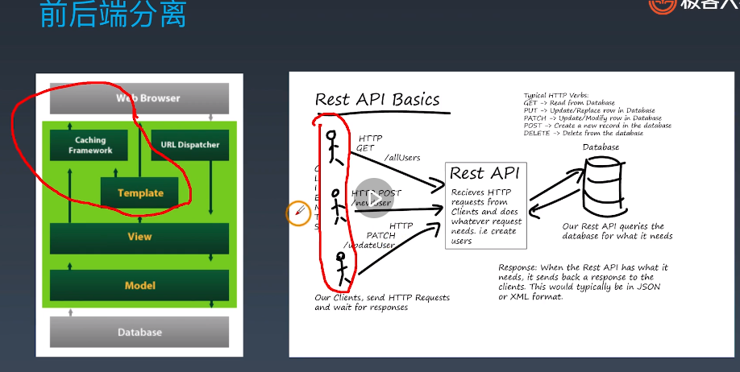
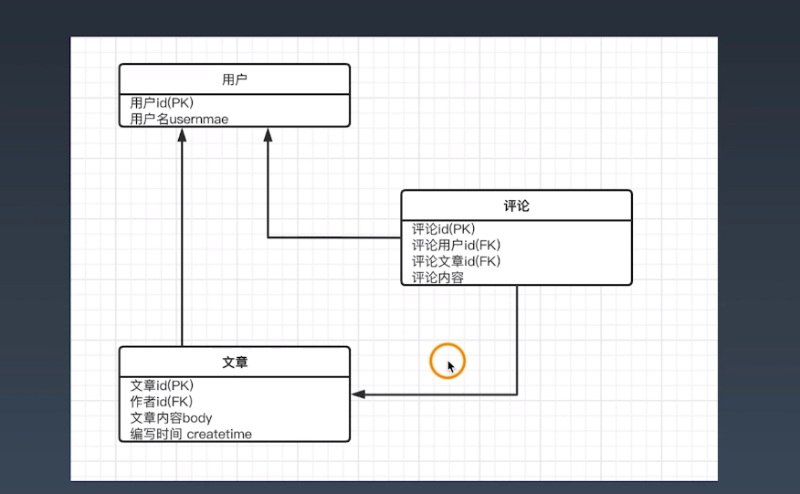

# WEEK09 动手实现一个文字版微博Web应用


## 后端开发为什么要使用前后端分离模式

1.前端展示的设备可能不同，但是希望使用统一的后端，使用django的template的耦合度太高，无法拆分

2.既要懂前端又要懂后端

前后端分离的优缺点：

+   前后端职责不清
+   APP类应用开发模式无法和MVC兼容
+   对前端性能造成局限




## REST API的用途和书写规范

前后端分离，引入新的解决方案就会引入新的问题


### REST概念

+   REST直接翻译的意思是"表现层状态转化"
+   基本工作过程：
    +   服务端将内部资源发布REST服务
    +   可无端通过URL来定位这些资源并通过HTTP协议来访问它们

### 动词：

+   一共五种：

    +   GET：读取(Read)
    +   POST:新建(Create)
    +   PUT:更新(Update)
    +   PATCH:更新(Update), 通常是部分更新
    +   DELETE：删除(Delete)

    

### 规范：

+   系统上的一切对象都要抽象为资源
+   每个资源对应唯一的资源标识(URL)
+   对资源的操作不能改变资源标识(URL)本身
+   所有的操作都是无状态的

例子：

```
{
	"meta":{
		"sucess":true,
		"message":"ok"
	},
	"data":...
}
```


### 风格指引：

+   尽量将API部署在专用域名之下
+   应该将API的版本号放入URL
+   路径又称"终点"(endpoint), 便是API的具体网址
+   API应该提供参数，过滤返回结果
+   服务器应该向用户返回正确的状态码和提示信息
+   尽量做好Hypermedia,即返回结果中提供链接，连向其他API方法，使得用户不查文档，也知道下一步应该做什么。


## 使用Django快速实现REST API


实战Django实现REST API

+   安装
    +   djangorestframework
+   序列化
    +   from rest_framework import serializers
+   Views
    +   FBV vs CBV （函数的方式和类的方式）


打开tutorial工程文件夹，执行命令`python manage.py runserver`可以运行起服务器


添加上要运行的APP

修改settings.py中的APPS, 添加上'rest_framework'，如果APP多的话不建议直接放在APP中，可以集中放在其他的文件，然后再引用这个文件，如：

```python
'snippets.apps.SnippetsConfig'
```


### 使用工程前先建表

1.  建表`python manage.py makemigrations (应用名)`
2.  `python manage.py migrate`
3.  创建超级用户 `python manage.py createsuperuser --email timo@a.com --username timo ` 


## 实现用户登录注册验证功能

记得先建表

microblog_v1:

1. models.py 构建模型:文章类
2. serializers.py 序列化：构建序列化的类， 文章序列化类、用户序列化类
3. views.py 视图 文章视图类 用户视图类 函数视图类
4. peimissions.py
5. urls.py 路径


移植步骤

1.  `__init__.py` 导入pymysql
2. settings.py 中引入rest_framework / rest_framework.authtoken / first
3.  settings.py中修改数据库的配置 DATABASES

4. settings.py 中的 REST_FRAMEWORK的设置 增加验证功能

   生成token方法

   ```python
   # token 
   # python3 manage.py shell
   # from rest_framework.authtoken.models import Token
   # from django.contrib.auth.models import User
   # token = Token.objects.create(user=User.objects.get(username='admin'))
   # print(token.key)
   # 'b5ac6763102540d26c620f0d764bea89b939b784'
   
   # basic
   # http -a admin:admin POST http://127.0.0.1:8000/api/v1/articles/ articleid="1004" article="aaa"
   ```

basic和session的方式一般用于测试 

5. 配置urls.py


## 实现文章关联功能

看urls.py中关联关系

```python
from django.urls import path, include
from rest_framework.routers import DefaultRouter
from first import views
from django.conf.urls import include

router = DefaultRouter()
router.register(r'articles', views.ArticleAPIViewSet)
router.register(r'users', views.UserViewSet)

urlpatterns = [
    path('', include(router.urls)),
]

```


views.py 就是返回对应请求到的接口

```python
@api_view(['GET', 'POST'])
def api_root(request, format=None):
    return Response({
        'users': reverse('user-list', request=request, format=format),
        'articles': reverse('article-list', request=request, format=format)
    })
```


自定义的权限在 permissions.py

```python
from rest_framework import permissions


class IsOwnerOrReadOnly(permissions.BasePermission):
    """
    自定义权限只允许对象的所有者编辑它。
    """

    def has_object_permission(self, request, view, obj):
        # 读取权限允许任何请求，
        # 所以我们总是允许GET，HEAD或OPTIONS请求。
        if request.method in permissions.SAFE_METHODS:
            return True

         # 只有该微博的所有者才允许写权限。
        return obj.owner == request.user

```


## 给django rest framework扩展文档和用户创建功能

pip install coreapi pyyaml


引入自动生成文档的api， urls.py:

```python
path('docs',include_docs_urls(title='BBS')),
```

可以通过 url `http://127.0.0.1:8000/api/v2/docs#articles-list`看文档


httpie的工具 ： pip install httpie

安装之后可以在命令行中做http请求

`http GET http://127.0.0.1:8000/api/v2/articles/ `

做修改

`http PUT http://127.0.0.1:8000/api/v2/articles/3/   article='PUT'`

以上会报错因为没有登录验证


修改为:

`http -a timo:520123 PUT http://127.0.0.1:8000/api/v2/articles/3/   article='PUT'`


删除：

`http  -a timo:520123 DELETE http://127.0.0.1:8000/api/v2/articles/3/  `


## 如何扩展现有用户属性

官方文档网站: https://docs.djangoproject.com/zh-hans/2.2/topics/auth/customizing/#extending-the-existing-user-model


编写过程: 模型-> 序列化->视图

当django原始创建用户的时候是不会对我们user模型进行联动的，所以要使用receiver装饰器

```python
    # 当生成 user 的时候自动生成 UserProfile
    # 原型是: receiver(signal, **kwargs), 当User产生post_save信号时 
    @receiver(post_save, sender=User)  
    def handler_user_create_content(sender, instance, created, **kwargs):
        # 如果第一次创建
        if created:  
            # 绑定User实例到UserProfile的username字段
            UserProfile.objects.create(username=instance)  
        
    @receiver(post_save, sender=User)  
    def handler_user_save_content(sender, instance, created, **kwargs):
        # profile = UserProfile.objects.create(username=instance)
        # 保存UserProfile的内容 ,profile是username字段外键的related_name名
        instance.profile.save()  
```


## 增加评论功能，实现两个自定义Model的关联屏

比如文章是一个表，评论是另一个表，这两者之间如何建立联系




## 实现搜索和站内消息

V5例程

pip install django-notifications-hq

```shell
python manage.py makemigrations (应用名)
python manage.py migrate
python3 manage.py migrate notifications
python manage.py createsuperuser --email timo@a.com --username timo
```


站内消息(小红点), 是使用的信号的机制来实现的


添加搜索的APP，settings.py里面的INSTALLED_APPS添加:

django自带的, 不够灵活

pip install django-filter

```python
'django_filters',  # 搜索
```

drf组件搜索

```python
'rest_framework',   # drf
```

官方文档: https://django-filter.readthedocs.io/en/1.1.0/guide/rest_framework.html#quickstart


发送消息:

参考文档:https://docs.djangoproject.com/zh-hans/2.2/topics/signals/

views.py

```python
# 发送通知
notify.send(user, recipient=recipient, verb = posts_content )
```

settings.py引入通知的app

安装通知的模块

pip install django-notifications-hq

建立通知的表

python3 manage.py migrate notifications

```python
'notifications'   # 通知
```

消息通知文档：https://pypi.org/project/django-notifications-hq/

