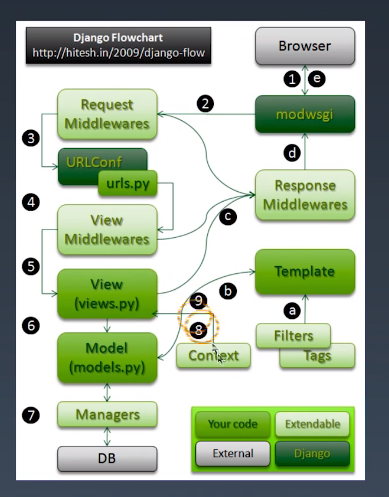
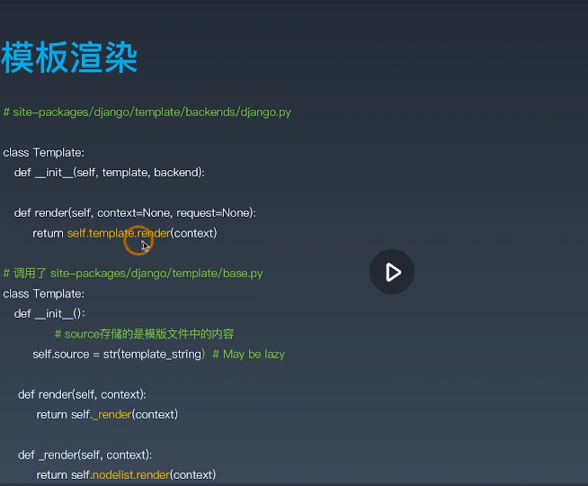
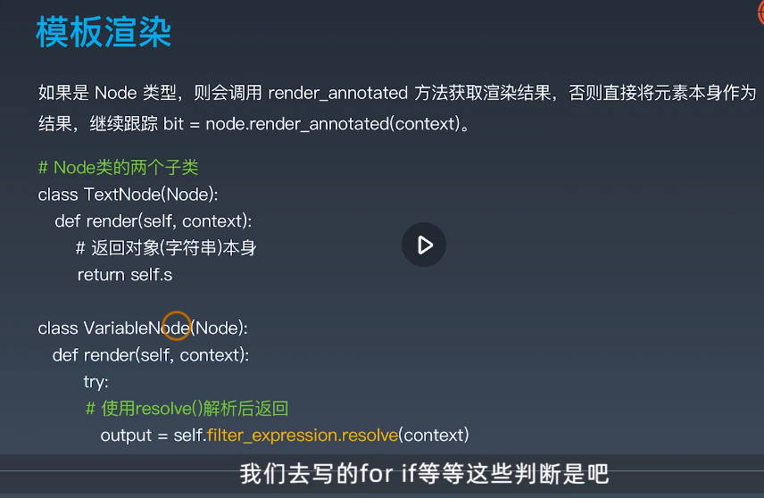
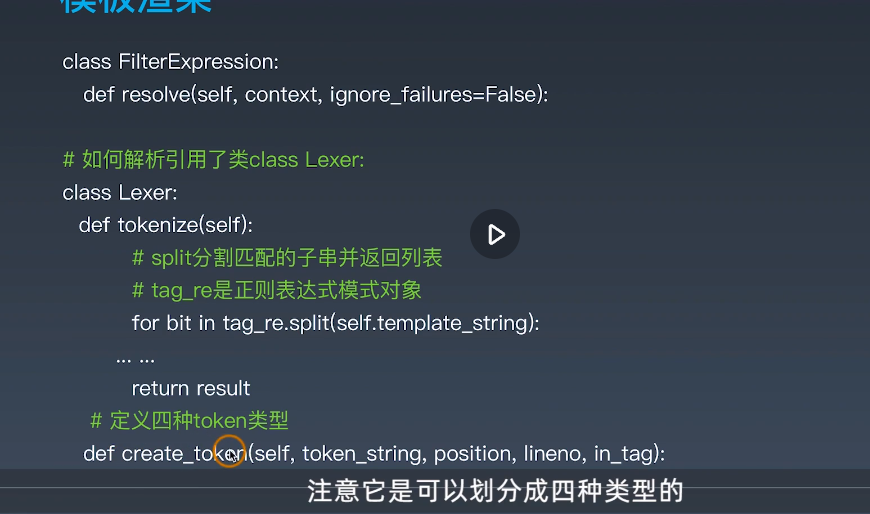
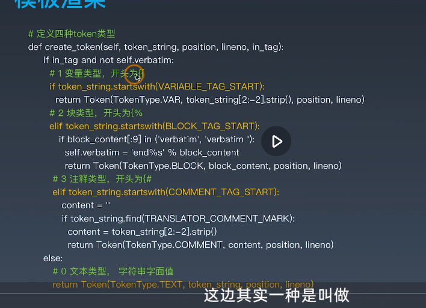

# Django源码分析

关键文件：

+ URLconf
+ View视图 
+ model模型 
+ template

## Django源码分析之URLconf的偏函数

urls.py 中的两个匹配函数 `path` `re_path`

偏函数 `partial` 是属于标准库`functools`中的一个函数

不熟悉函数去看官方文档:  https://docs.python.org/zh-cn/3/library/functools.html

偏函数的作用: 

+ 固定函数的一些参数+
+ 不同场景下不必要的参数可以固定下来，必要的参数才从外部传递进来

例程，2进制字符串转10进制:

原本需要这么调用`int('10010', 2)`

```python
from functools import partial
basetwo = partial(int, base=2)
basetwo.__doc__ = 'Convert base 2 string to an int.'
basetwo('10010')
# 18
```

要注意:

+ partial第一个参数必须是可调用对象
+ 参数传递顺序是从左到右， 但不能超过原函数参数个数
+ 关键字参数会覆盖partial中定义好的参数


## Django源码分析之URLconf的include

分析urls.py中path的include是如何通过传递字符串或者元组导入我们自己的模块

```python
path('', include('index.urls')),
```

关键函数: `import_module`


`site-packages/django/urls/conf.py`中

```python
if isinstance(urlconf_module, str):
        urlconf_module = import_module(urlconf_module)
patterns = getattr(urlconf_module, 'urlpatterns', urlconf_module)
app_name = getattr(urlconf_module, 'app_name', app_name)
```


如果是元组

```python
if isinstance(arg, tuple):
        # Callable returning a namespace hint.
        try:
            urlconf_module, app_name = arg
```

上面对元组参数做了拆分， 相当于 a, b = ('douban.index', 'douban')


如果是字符串

```python
if isinstance(urlconf_module, str):
    urlconf_module = import_module(urlconf_module)
patterns = getattr(urlconf_module, 'urlpatterns', urlconf_module)
app_name = getattr(urlconf_module, 'app_name', app_name)
```


## Django源码分析之view视图的请求过程

请求过程由WSGI创建

render是对httprespense上的又一层封装

```python
def index(request):
    # http://127.0.0.1:8000/?id=1&id=2&name=wilson
    # print(request.GET)
    # <QueryDict: {'id': ['1', '2'], 'name': ['wilson']}>
    return HttpResponse("Hello Django!")
```

重点 `HttpRequest` 和 `HttpResponse`

class HttpRequest: 中

```python
def __init__(self):
    # WARNING: The `WSGIRequest` subclass doesn't call `super`.
    # Any variable assignment made here should also happen in
    # `WSGIRequest.__init__()`.

    self.GET = QueryDict(mutable=True)
    self.POST = QueryDict(mutable=True)
    self.COOKIES = {}
    self.META = {}
    self.FILES = MultiValueDict()

    self.path = ''
    self.path_info = ''
    self.method = None
    self.resolver_match = None
    self.content_type = None
    self.content_params = None
```

继承：

QueryDict -> MultiValueDict ->dict

当key相同的时候用不了原始的dict, 所以引入querdict。当key相同value可以是多个值


```python
# views.py
def index(request):
    # http://127.0.0.1:8000/?id=1&id=2&name=wilson
    print(request.GET)
    # <QueryDict: {'id': ['1', '2'], 'name': ['wilson']}>
    return HttpResponse("Hello Django!")
```


## Django源码分析之view视图的响应过程

响应过程由程序员来创建

### 响应

```python
def test1(request):
    # 已经引入了HttpResponse
    # from django.http import HttpResponse
    response1 = HttpResponse()
    response2 = HttpResponse("Any Text", content_type="text/plain")
    return response1

def test2(request):
    # 使用HttpResponse的子类
    from django.http import JsonResponse
    response3 = JsonResponse({'foo':'bar'}) # response.content
    response3['Age'] = 120
    
    #没有显式指定404
    from django.http import HttpResponseNotFound
    response4 = HttpResponseNotFound('<h1>Page not found</h1>')
    return response4
    
```

可以通过官方文档搜索关键字的方式看例程


## Django源码分析之view视图的请求响应完整流程




2 中的request middlewares可以做一个反爬虫，判断有没cookies或者特殊的请求头

上图字母标注代表扩展

8 context上下文用于解耦模型和view视图

wsgi： web server gateway interface 服务器网关接口


## Django源码分析之model模型的自增主键创建

Model

为什么自定义的Model要继承models.Model?

+ 不需要显示定义主键
+ 自动拥有查询管理器对象
+ 可以使用ORM API对数据库、表实现CRUD

```python
# 作品名称和作者(主演)
class Name(models.Model):
    # id = models.BigAutoField(primary_key=True)
    # id自动创建
    name = models.CharField(max_length=50)
    author = models.CharField(max_length=50)
    stars = models.CharField(max_length=5)
```

base.py:

`class Model(metaclass=ModelBase):` 元类，什么时候使用元类，创建类的时候希望增加一些自己的额外功能。

`class ModelBase(type):`元类的父类一定是type 而不是 object

options.py:

```python
def _prepare(self, model):
```

重点是引用了元类，改变创建类的过程这一行为


## Django源码分析之model模型的查询管理器

model动态创建类的过程

```python
def books_short(request):
    ### 从 models 取数据传给template ###
    shorts = T1.bojects.all()
```

+ 如何让查询管理器的名称不叫作objects?
+ 如何利用Manager(objects)实现对Model的CRUD？
+ 为什么查询管理器返回QuerSet对象?

```python
# site-packages/django/db/models/manager.py
class Manager(BasseManager.from_queryset(QuerSet)):
    pass
```

Manager继承自BaseManagerFromQuerySet类，拥有QuerySet的大部分方法, get、crete、filter等方法都来自QuerySet


## Djang源码分析之template模板的加载文件

模板引擎

+ 模板引擎怎么通过render()i今安在HTML文件?
+ 模板引擎怎样对模板进行渲染?

```python
def books_short(request):
    return render(request, 'result.html', locals())
```

```python
# \site-packages\django\shortcuts.py

def render(request, template_name, context=None, content_type=None, status=None, using=None):
    content = loader.render_to_string(template_name, context, request, using=using)
    return HttpResponse(content, content_type, status)
```


render -> render_to_string->get_template->engine.get_template->find_template


## Django源码分析之template模板的渲染









{}变量 %块类型  #注释  

